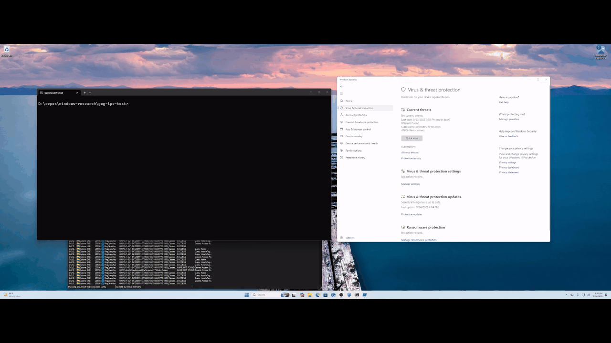

# GOG Galaxy Local Privilege Escalation PoC

Proof of concept for a DLL search-order hijack in the GOG Galaxy `GalaxyCommunication` service. A local user who can write `IPHLPAPI.DLL` beside `GalaxyCommunication.exe` and start the service can execute code as `NT AUTHORITY\SYSTEM`.

## Demo



Tested with `GalaxyCommunication.exe` 2.0.6.28 on Windows 10 Pro 25H2.

## Build

Install the Visual Studio C++ x86 build tools, then run:

```powershell
.\build.cmd
```

## Run

From a non-elevated PowerShell session, run:

```powershell
.\run.ps1
```

The script deploys the DLL, starts the service, opens a SYSTEM command prompt, removes the DLL, and restores the original service state.

Use only on systems you own or are authorized to test.
